# Cross-site scripting (XSS) 
## Tổng quan

Cross-site scripting (còn được gọi là XSS) là một lỗ hổng bảo mật web cho phép kẻ tấn công xâm phạm các tương tác mà người dùng có với một ứng dụng dễ bị tấn công. Nó cho phép kẻ tấn công lách chính sách cùng nguồn gốc, được thiết kế để tách biệt các trang web khác nhau với nhau. Các lỗ hổng cross-site scripting thường cho phép kẻ tấn công ngụy trang thành người dùng nạn nhân, thực hiện bất kỳ hành động nào mà người dùng có thể thực hiện và truy cập bất kỳ dữ liệu nào của người dùng. Nếu người dùng nạn nhân có quyền truy cập đặc quyền trong ứng dụng, thì kẻ tấn công có thể giành được quyền kiểm soát hoàn toàn đối với tất cả các chức năng và dữ liệu của ứng dụng.

Tấn công XSS đang được thực hiện ở phía client. Nó có thể được thực hiện với các ngôn ngữ lập trình phía client khác nhau. Tuy nhiên, thường xuyên nhất cuộc tấn công này được thực hiện với Javascript và HTML.

## Cách thức hoạt động

Cross-site scripting hoạt động bằng cách thao túng một trang web dễ bị tấn công để trả về JavaScript độc hại cho người dùng. Khi mã độc hại thực thi bên trong trình duyệt của nạn nhân, kẻ tấn công có thể xâm phạm hoàn toàn tương tác của họ với ứng dụng.

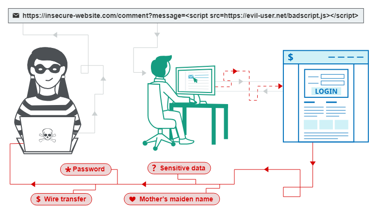

## Các dạng lỗ hổng Cross-site scripting (XSS)
XSS thường được chia làm 3 dạng chính:

* `Reflected XSS:` xảy ra khi mã độc được truyền vào trang web bằng cách sử dụng một liên kết hoặc biểu mẫu web. (Script độc hại có nguồn gốc từ request HTTP hiện tại mà không được làm sạch hay mã hóa)

* `Stored XSS:` xảy ra khi mã độc được lưu trữ trên máy chủ và được thực thi khi người dùng truy cập trang web có chứa mã độc đó. (Script độc hại có nguồn gốc từ phía máy chủ, chẳng hạn database)
* `DOM-based XSS:` xảy ra khi mã độc được chèn vào trang web bằng cách sử dụng các tài nguyên không được lưu trữ trên máy chủ, mà được tải từ máy chủ và xử lý trên trình duyệt của người dùng. (Script độc hại tồn tại trong client-side code)

## Reflected XSS

### Lab: Reflected XSS into HTML context with nothing encoded

Bản chất lỗ hỏng XSS là có input từ người dùng nên ta thử những nơi mà ta có thể đưa input vàovào

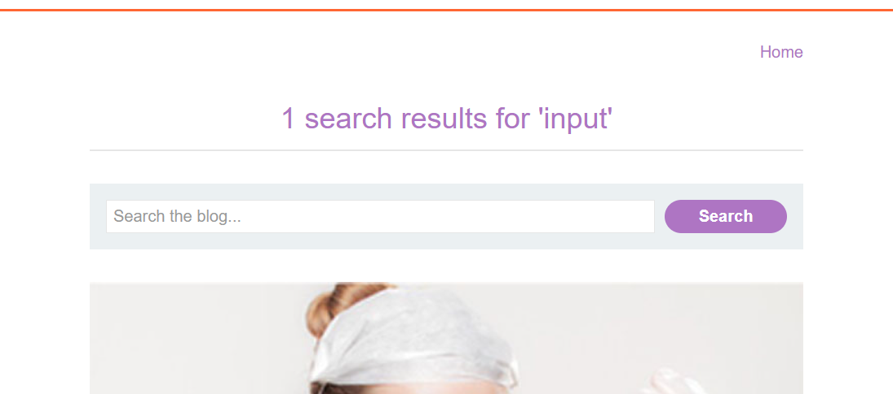

Kiểm tra mã nguồn thấy đầu vào `input` được đưa vào thẻ `h1`

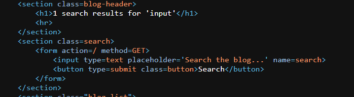

Truyền script vào để kiểm tra XSS : Payload `` => done

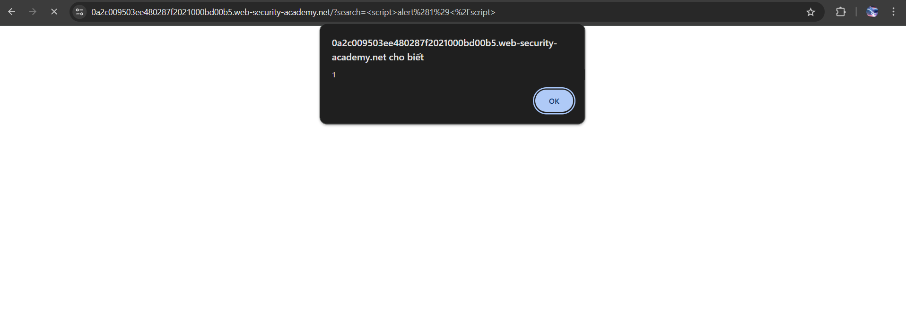

### Lab: Reflected XSS into HTML context with most tags and attributes blocked

Thử truyền payload `` :

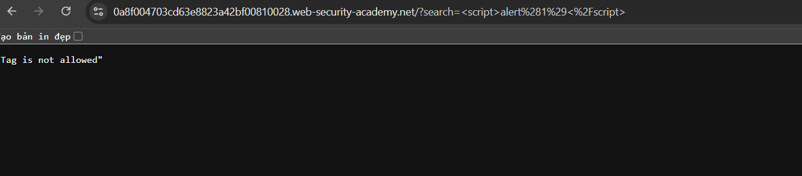

=> thấy tag bị chặn

Dùng Brup Suite để tìm các tag không bị chặn:

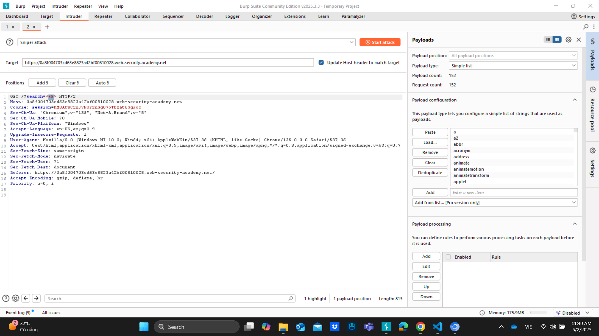

Tìm được tag `body` không bị chặn 

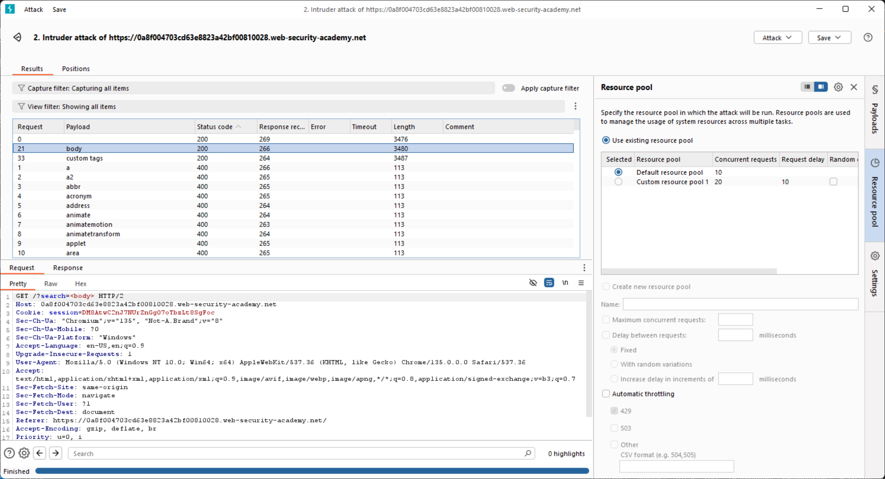

Tiếp theo tìm event không bị chặn của `body` là `onresize`

Truy cập `exploit server` và dán payload `<iframe src="https://0a8f004703cd63e8823a42bf00810028.web-security-academy.net/?search=%22%3E%3Cbody%20onresize=print()%3E" onload=this.style.width='200px'>` vào phần body:

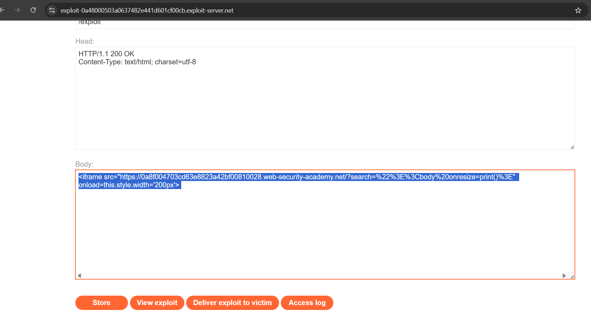

Injection này chứa event `onresize` kích hoạt hàm `print`, event  `onload` trong chính thẻ `<iframe>` gây ra thay đổi kích thước => kích hoạt sự kiện `onresize` 

**Store** và  **Deliver exploit to victim** => done

### Lab: Reflected XSS into HTML context with all tags blocked except custom ones

Truy cập `exploit server` và dán payload
`` vào `body` 

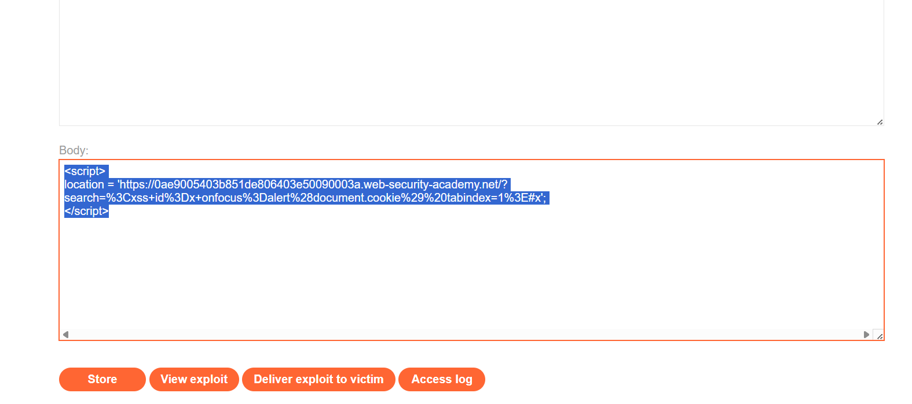

Injection này tạo ra một custom tag với `id`=x, chứa event `onfocus` kích hoạt hàm `alert`. Dấu `#x `ở cuối URL sẽ di chuyển con trỏ đến phần tử có id="x", từ đó làm cho nó được focus → kích hoạt alert(document.cookie).

**Store** và  **Deliver exploit to victim** => done

Truyền payload `` => thấy được dấu `<`, `>`bị encode thành `&lt;` và `&gt;` => không chạy script trong thẻ `h1` được 

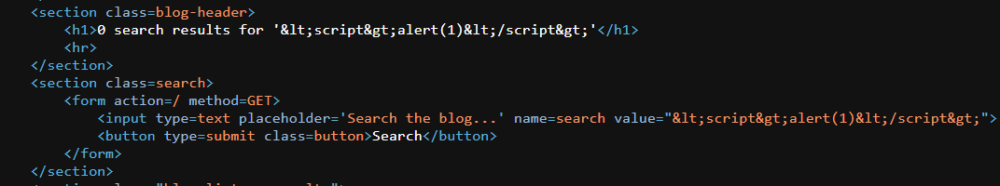

Nhận thấy đầu vào có nằm trong thuộc tính `value` của thẻ `input` => giải pháp: thêm sự kiện trong thẻ `input` để kích hoạt hàm `alert` 

VD truyền vào `"onclick= "alert(1)` => khi click vào `input` thì sẽ hiện alert => done

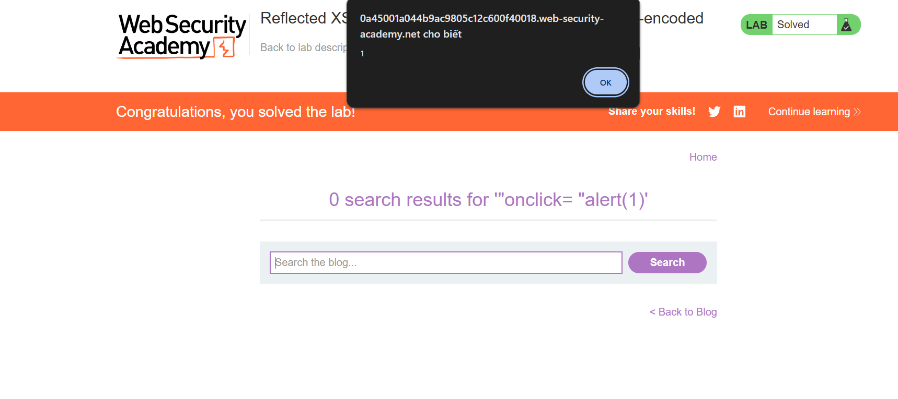

Ngoài ra còn có các event như: `onfocus`, `oninput`, `onmouseout`, `onmouseover`,...

### Lab: Reflected XSS into a JavaScript string with angle brackets HTML encoded

### Lab: Reflected XSS into a JavaScript string with single quote and backslash escaped

Search thử đầu vào là `input` thấy đầu vào được sử dụng trong biến `searchTerms` 

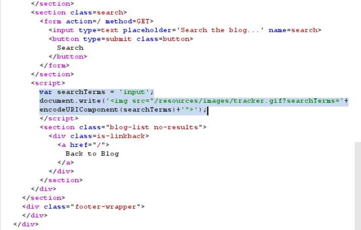

=> Thử thoát khỏi chuỗi bằng cách thử đầu vào là `';alert(2)//` ta thấy dấu `'` bị escape 

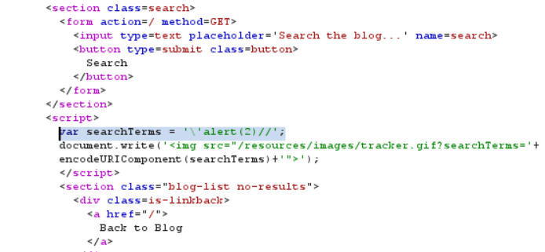

=> Thử thoát tiếp bằng cách thêm `backslash` vào trước `'` : `\';alert(2)//`

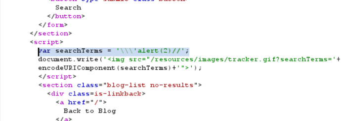

Vẫn bị escape => Thử cách thoát khỏi `script` bằng cách `</script> ` 

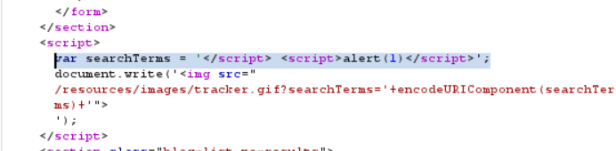

Đầu vào không bị encode =>done 

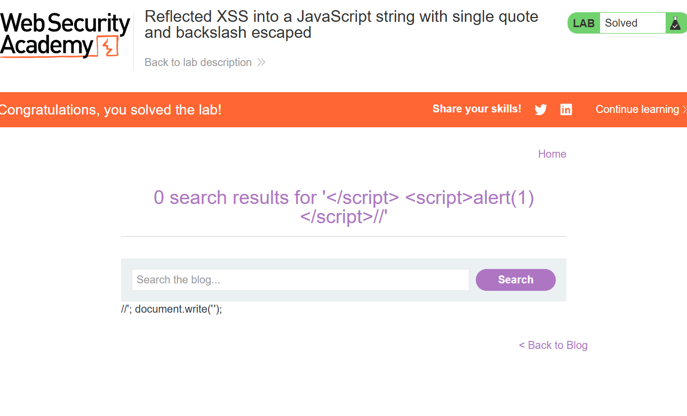

## Stored XSS 

### Lab: Stored XSS into anchor href attribute with double quotes HTML-encoded

test thử 1 comment: 

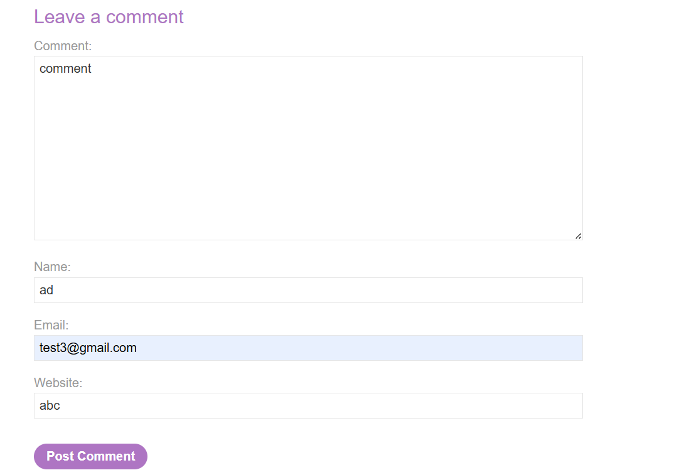

Mở nguồn html và Burp suite ta thấy giá trị `website` được chuyển vào `href` của thẻ `a` 

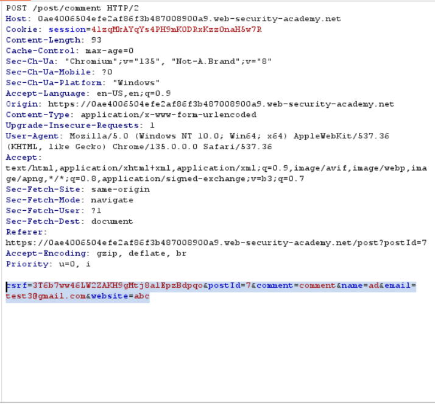

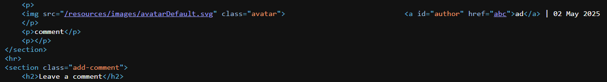

Thử cho `website` = `abc"+onclick%3d"alert(1)` xem có bypass không

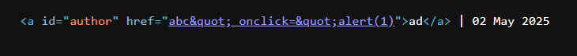

Thấy được `"` bị encode thành `&quot;` => Cách này không được

Thử dùng JavaScript URL `javascript:alert(1)` => done 

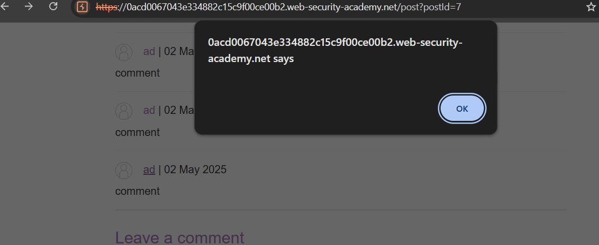

### Lab: Stored XSS into onclick event with angle brackets and double quotes HTML-encoded and single quotes and backslash escaped

Test thử 1 comment 

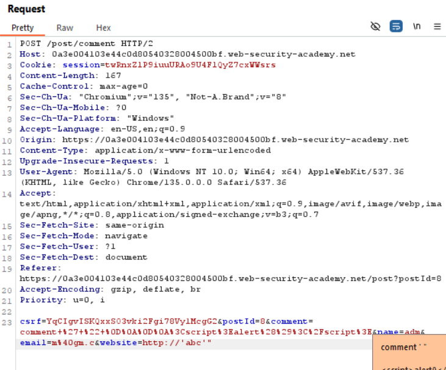

Mở mã nguồn html ta thấy giá trị  `'`, `"`, `<`, `>` của comment bị encode => không chạy script trong comment được

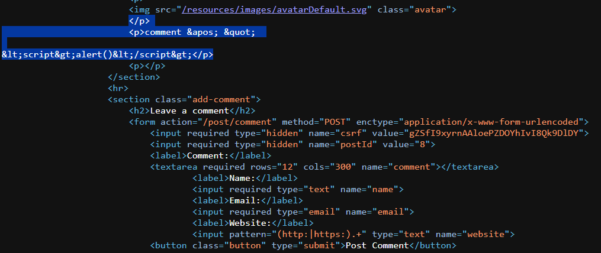

Ở thẻ `a` ta thấy được:

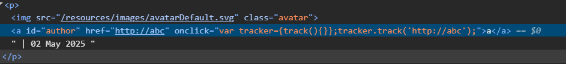

Có thể thử xem thoát khỏi thuộc tính `href`, hay `onclick` xem được không.

Tuy nhiên nó cũng không thành công vì `'`, `\` bị escape , `"` `<`, `>` bị HTML-encoded 

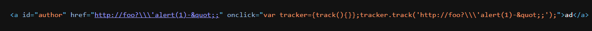

=> Thử HTML-encoder `'` thành `&apos;` để bypass phía server. Bypass thành công thì khi ta click vào `author` thì Browser sẽ giải mã HTML các thuộc tính trước rồi javascript sẽ thực thi lệnh `alert()`

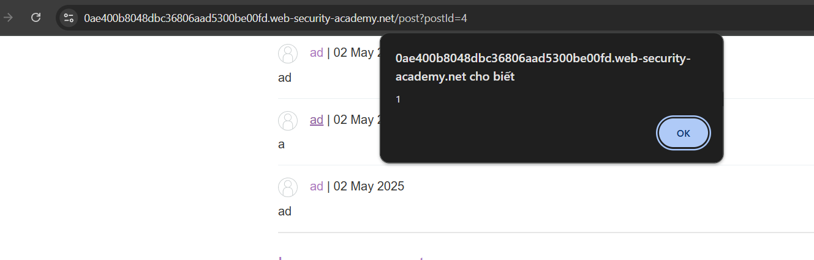

=> Done 
## DOM-based XSS

Lỗ hổng XSS dựa trên DOM thường phát sinh khi JavaScript lấy dữ liệu từ nguồn do kẻ tấn công kiểm soát, chẳng hạn như URL, và chuyển dữ liệu đó đến một bộ đệm hỗ trợ thực thi mã động, chẳng hạn như eval()hoặc innerHTML. Điều này cho phép kẻ tấn công thực thi JavaScript độc hại, thường cho phép chúng chiếm đoạt tài khoản của người dùng khác.

Để thực hiện cuộc tấn công XSS dựa trên DOM, bạn cần đưa dữ liệu vào nguồn để dữ liệu đó được truyền đến bộ thu và gây ra việc thực thi JavaScript tùy ý.

Nguồn phổ biến nhất cho DOM XSS là URL, thường được truy cập bằng đối tượng window.location . Kẻ tấn công có thể xây dựng một liên kết để gửi nạn nhân đến một trang dễ bị tấn công với một tải trọng trong chuỗi truy vấn và các phần phân đoạn của URL. Trong một số trường hợp nhất định, chẳng hạn như khi nhắm mục tiêu vào trang 404 hoặc một trang web chạy PHP, tải trọng cũng có thể được đặt trong đường dẫn.

### Lab: DOM XSS in document.write sink using source location.search inside a select element

Mở mã nguồn html, ta thấy `Script` đã trích xuất 1 tham số `storeId` từ `local.search`. Sau đó cho vào `document.write('<option selected>...')` 

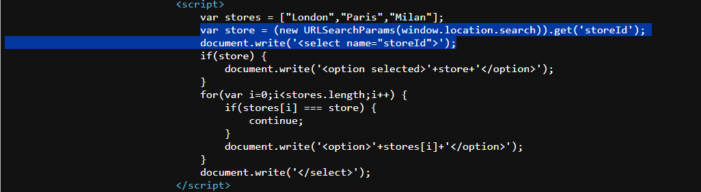

=> Thoát khỏi thẻ `select` hoặc thẻ `option` bằng cách truyền tham số `storeId` 

=> Truyền  `productId=1&storeId=z</option>`  hoặc `productId=1&storeId=z</select>`

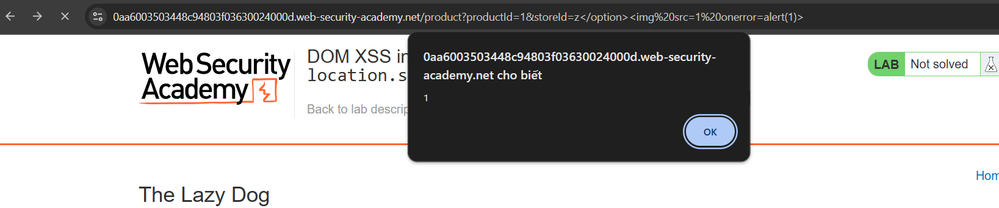

=>done 

### Lab: DOM XSS in jQuery anchor href attribute sink using location.search source

Mở mã nguồn html của trang `feedback` ta thấy hàm `attr()` - hàm có thể thay đổi các thuộc tính của các phần tử DOM. Mà trong đó sử dụng dữ liệu mà ta có thể thay đổi data của tham số `returnPath` - tham số mà `location.search` trích xuất từ URL 

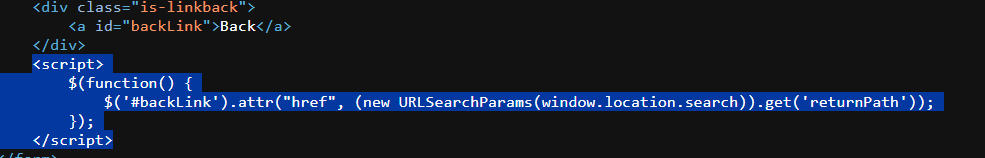

=> Truyền Payload `web-security-academy.net/feedback?returnPath=javascript:alert(1)` => Done 

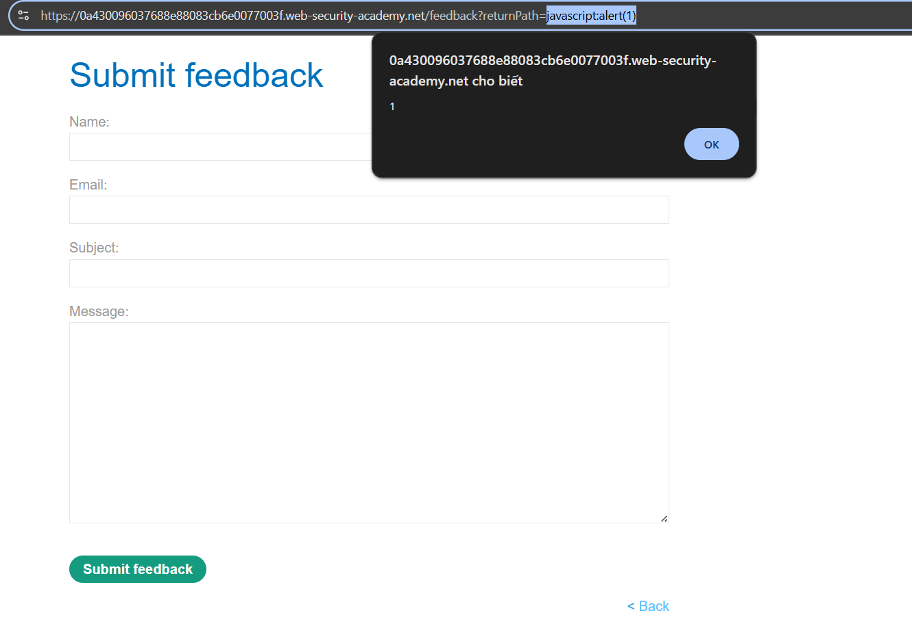