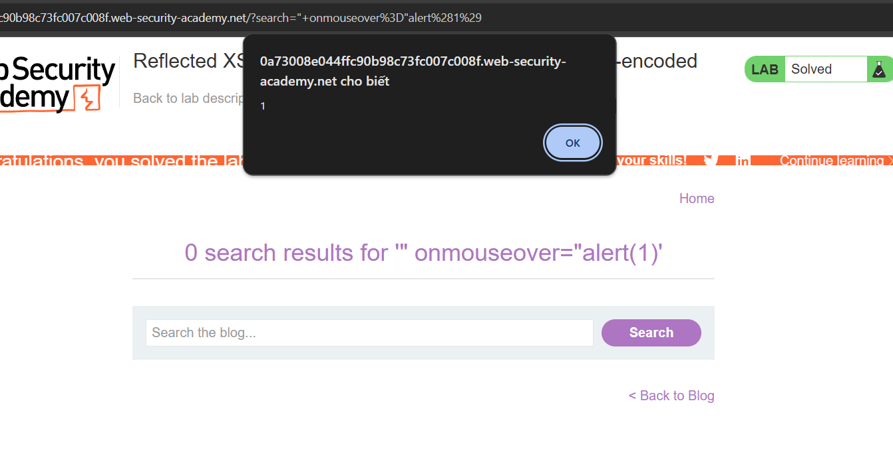

# Cross-site scripting (XSS) 
## Tổng quan

Cross-site scripting (còn được gọi là XSS) là một lỗ hổng bảo mật web cho phép kẻ tấn công xâm phạm các tương tác mà người dùng có với một ứng dụng dễ bị tấn công. Nó cho phép kẻ tấn công lách chính sách cùng nguồn gốc, được thiết kế để tách biệt các trang web khác nhau với nhau. Các lỗ hổng cross-site scripting thường cho phép kẻ tấn công ngụy trang thành người dùng nạn nhân, thực hiện bất kỳ hành động nào mà người dùng có thể thực hiện và truy cập bất kỳ dữ liệu nào của người dùng. Nếu người dùng nạn nhân có quyền truy cập đặc quyền trong ứng dụng, thì kẻ tấn công có thể giành được quyền kiểm soát hoàn toàn đối với tất cả các chức năng và dữ liệu của ứng dụng.

Tấn công XSS đang được thực hiện ở phía client. Nó có thể được thực hiện với các ngôn ngữ lập trình phía client khác nhau. Tuy nhiên, thường xuyên nhất cuộc tấn công này được thực hiện với Javascript và HTML.

## Cách thức hoạt động

Cross-site scripting hoạt động bằng cách thao túng một trang web dễ bị tấn công để trả về JavaScript độc hại cho người dùng. Khi mã độc hại thực thi bên trong trình duyệt của nạn nhân, kẻ tấn công có thể xâm phạm hoàn toàn tương tác của họ với ứng dụng.


## Các dạng lỗ hổng Cross-site scripting (XSS)
XSS thường được chia làm 3 dạng chính:

* `Reflected XSS:` xảy ra khi mã độc được truyền vào trang web bằng cách sử dụng một liên kết hoặc biểu mẫu web. (Script độc hại có nguồn gốc từ  HTTP request hiện tại mà không được làm sạch hay mã hóa)

* `Stored XSS:` xảy ra khi mã độc được lưu trữ trên máy chủ và được thực thi khi người dùng truy cập trang web có chứa mã độc đó. (Script độc hại có nguồn gốc từ phía máy chủ, chẳng hạn database)

* `DOM-based XSS:` xảy ra khi mã độc được chèn vào trang web bằng cách sử dụng các tài nguyên không được lưu trữ trên máy chủ, mà được tải từ máy chủ và xử lý trên trình duyệt của người dùng. (Script độc hại tồn tại trong client-side code)


## Reflected XSS

Dạng lỗ hổng Reflected XSS xảy ra khi mã độc được truyền vào trang web bằng cách sử dụng một URL hoặc biểu mẫu web chứa mã javascript. Tức script độc hại có nguồn gốc từ  HTTP request hiện tại và được Backend gửi trả lại HTTP response cho Browser mà không được mã hóa. Khi đó Browser sẽ thực thi mã javascript. 

Để tấn công Reflected XSS, kẻ tấn công cần phải dụ dỗ nạn nhân truy cập vào URL hoặc điền vào form nội dung chứa mã script. 

### Lab: Reflected XSS into HTML context with nothing encoded

Bản chất lỗ hỏng XSS là có input từ người dùng nên ta thử những nơi mà ta có thể đưa input vào


Kiểm tra mã nguồn thấy đầu vào `input` được đưa vào thẻ `h1`


Truyền script vào để kiểm tra XSS : Payload `<script>alert(1)</script>` => done


## Stored XSS 

Lỗi Stored XSS phát sinh khi một ứng dụng nhận dữ liệu từ một nguồn không đáng tin cậy và đưa dữ liệu đó vào các phản hồi HTTP sau đó theo cách không an toàn. 

Ví dụ: 1 website có chức năng cho phép người dùng bình luận và hiển thị nó cho người dùng khác mà không xử lý đầu vào. Kẻ tấn công có thể gửi 1 bình luận có nội dung chứa mã javascript. Bình luận này được lưu ở phía server và khi nạn nhân truy cập trang chứa bình luận đó, Browser sẽ thực thi mã độc đó. 

### Lab: Stored XSS into HTML context with nothing encoded
Viết comment và post nó lên. 


Mở mã nguồn HTML ta thấy nội dung comment được đưa vào thẻ `p`


=> payload: `<script>alert(1)</script>` => Done 

## DOM-based XSS

Lỗ hổng XSS dựa trên DOM thường phát sinh khi JavaScript lấy dữ liệu từ nguồn do kẻ tấn công kiểm soát, chẳng hạn như URL, và chuyển dữ liệu đó đến một bộ đệm hỗ trợ thực thi mã động, chẳng hạn như eval() hoặc innerHTML. Điều này cho phép kẻ tấn công thực thi JavaScript độc hại, thường cho phép chúng chiếm đoạt tài khoản của người dùng khác.

Để thực hiện cuộc tấn công XSS dựa trên DOM, bạn cần đưa dữ liệu vào nguồn để dữ liệu đó được truyền đến bộ thu và gây ra việc thực thi JavaScript tùy ý.

Nguồn phổ biến nhất cho DOM XSS là URL, thường được truy cập bằng đối tượng window.location . Kẻ tấn công có thể xây dựng một liên kết để gửi nạn nhân đến một trang dễ bị tấn công với một tải trọng trong chuỗi truy vấn và các phần phân đoạn của URL. Trong một số trường hợp nhất định, chẳng hạn như khi nhắm mục tiêu vào trang 404 hoặc một trang web chạy PHP, tải trọng cũng có thể được đặt trong đường dẫn.

Sau đây là một số nguyên nhân chính có thể dẫn đến lỗ hổng DOM-XSS:

```powershell 
document.write()
document.writeln()
document.domain
element.innerHTML
element.outerHTML
element.insertAdjacentHTML
element.onevent
```

### Lab: DOM XSS in document.write sink using source location.search

Kiểm tra chức năng Search với một chuỗi ngẫu nhiên:


Từ đoạn script xử lý chuỗi tìm kiếm, ta thấy: 
* Biến `query` lấy giá trị tham số search từ URL qua hàm `URLSearchParams()`.
* Nếu biến `query` khác rỗng thì gọi hàm `trackSearch()`, sử dụng hàm `document.write()` ghi nội dung ``

Do biến query chúng ta có thể thay đổi được nên đồng nghĩa với việc chúng ta có thể tác động vào giá trị thẻ `` => có thể dùng thuộc tính `onerror` để kích hoạt sự kiện `alert()`

=> Payload: 
```powershell
abc" onerror="alert(1)
```


=> Done 

### Lab: DOM XSS in document.write sink using source location.search inside a select element

Mở mã nguồn html, ta thấy `Script` đã trích xuất 1 tham số `storeId` từ `local.search`. Sau đó cho vào `document.write('<option selected>...')` 


=> Thoát khỏi thẻ `select` hoặc thẻ `option` bằng cách truyền tham số `storeId` 

=> Truyền  `productId=1&storeId=z</option>`  hoặc `productId=1&storeId=z</select>`


=> Done 

### Lab: DOM XSS in jQuery anchor href attribute sink using location.search source

Mở mã nguồn html của trang `feedback` ta thấy hàm `attr()` - hàm có thể thay đổi các thuộc tính của các phần tử DOM. Mà trong đó sử dụng dữ liệu mà ta có thể thay đổi data của tham số `returnPath` - tham số mà `location.search` trích xuất từ URL 


=> Truyền Payload `web-security-academy.net/feedback?returnPath=javascript:alert(1)` => Done 


## Cross-Site Scripting contexts

`XSS contexts` là những vị trí trong HTML/JavaScript mà dữ liệu đầu vào không an toàn có thể bị chèn vào, dẫn đến thực thi mã độc nếu không được xử lý đúng cách. Dựa vào `XSS contexts`  ta có thể chọn các payload XSS để kiểm tra nó có hiệu quả không.

`XSS contexts` được chia làm 3 dạng: 

* **XSS between HTML tags**: Dữ liệu được chèn trực tiếp vào giữa các thẻ HTML.

* **XSS in HTML tag attributes**: Dữ liệu nằm trong giá trị của thuộc tính HTML.

* **XSS into JavaScript**: Dữ liệu được chèn vào mã JavaScript.

### XSS between HTML tags

Trong ảnh dưới đây, dữ liệu đầu vào `input` được reflected trong cặp thẻ `h1`


Khi dữ liệu nằm trực tiếp vào giữa các thẻ HTML, ta có thể  dùng các thẻ HTML, thẻ script để thực thi lệnh javascript

Ta có thể dùng 1 số thẻ sau để kiểm tra lỗ hỏng XSS:
```powershell
<script>alert(document.domain)</script>

```

#### Lab: Reflected XSS into HTML context with most tags and attributes blocked

Thử truyền payload `<script>alert(1)</script>` :


=> thấy tag bị chặn

Dùng Brup Suite để tìm các tag không bị chặn:


Tìm được tag `body` không bị chặn 


Tiếp theo tìm event không bị chặn của `body` là `onresize`

Truy cập `exploit server` và dán payload `<iframe src="https://0a8f004703cd63e8823a42bf00810028.web-security-academy.net/?search=%22%3E%3Cbody%20onresize=print()%3E" onload=this.style.width='200px'>` vào phần body:


Injection này chứa event `onresize` kích hoạt hàm `print`, event  `onload` trong chính thẻ `<iframe>` gây ra thay đổi kích thước => kích hoạt sự kiện `onresize` 

**Store** và  **Deliver exploit to victim** => done

#### Lab: Reflected XSS into HTML context with all tags blocked except custom ones

Truy cập `exploit server` và dán payload
`<script>
location = 'https://0ae9005403b851de806403e50090003a.web-security-academy.net/?search=%3Cxss+id%3Dx+onfocus%3Dalert%28document.cookie%29%20tabindex=1%3E#x';
</script>` vào `body` 


Injection này tạo ra một custom tag với `id`=x, chứa event `onfocus` kích hoạt hàm `alert`. Dấu `#x `ở cuối URL sẽ di chuyển con trỏ đến phần tử có id="x", từ đó làm cho nó được focus → kích hoạt alert(document.cookie).

**Store** và  **Deliver exploit to victim** => done

Truyền payload `<script>alert(1)</script>` => thấy được dấu `<`, `>`bị encode thành `&lt;` và `&gt;` => không chạy script trong thẻ `h1` được 


Nhận thấy đầu vào có nằm trong thuộc tính `value` của thẻ `input` => giải pháp: thêm sự kiện trong thẻ `input` để kích hoạt hàm `alert` 

VD truyền vào `"onclick= "alert(1)` => khi click vào `input` thì sẽ hiện alert => done


Ngoài ra còn có các event như: `onfocus`, `oninput`, `onmouseout`, `onmouseover`,...

#### Lab: Reflected XSS with some SVG markup allowed

Nhập dữ liệu đầu vào là `helo` rồi mở mã nguồn HTML. Ta thấy dữ liệu được reflected trong thẻ `h1`


Thử 1 payload XSS:

```powershell 
<script>alert()</script> 
```
Ta thấy thông báo thẻ này đã bị chặn.


=> Dùng Burp Suite để kiểm tra xem thẻ nào cho phép => có thẻ  `<svg>`, `<animatetransform>`, `<title>`, và `<image>`đã nhận được phản hồi 200.


Sử dụng 2 thẻ `<svg>`, `<animatetransform>` và kiểm tra xem có event nào được cho phép => có event `onbegin` được phản hồi 200. 

=> sử dụng payload: `<svg><animatetransform+onbegin%3Dalert%281%29><%2Fsvg>`:


=> Done 

### XSS in HTML tag attributes 

Ở ảnh dưới, dữ liệu `http://abc` được đưa vào thuộc tính thẻ HTML. Khi đó, ta có thể chấm dứt giá trị thuộc tính, đóng thẻ và tạo một thẻ mới để thực thi mã script.


#### Lab: Reflected XSS into attribute with angle brackets HTML-encoded

Viết payload XSS `<script>alert(1)</script>` và search.


Mở mã nguồn ta thấy dấu `<`, `>` bị HTML-encode ở thẻ `h1` và ở trong thuộc tính `value` trong thẻ `input`.


=> Có thể kết thúc thuộc tính `value` và sử dụng các `event` của thẻ `input` như `onmouseover`, `onclick`, ... để kích hoạt mã javascript.

=> Sử dụng payload: `" onmouseover="alert(1)` 



=> Done

Đôi khi vị trí XSS nằm trong một loại thuộc tính thẻ HTML mà bản thân nó có thể tạo ra ngữ cảnh có thể lập trình được. Ở đây, ta có thể thực thi JavaScript mà không cần phải chấm dứt giá trị thuộc tính. Ví dụ, nếu vị XSS nằm trong  thuộc tính `href` của thẻ anchor, ta có thể sử dụng `pseudo-protocol` javascript để thực thi tập lệnh

#### Lab: Stored XSS into anchor href attribute with double quotes HTML-encoded

test thử 1 comment: 


Mở nguồn html và Burp suite ta thấy giá trị `website` được chuyển vào thuộc tính `href` của thẻ `a` 


Thử cho `website` = `abc"+onclick%3d"alert(1)` xem có thoát khỏi thuộc tính `href` không


Thấy được `"` bị encode thành `&quot;` => Cách này không được

Thử dùng `pseudo-protocol` javascript: `javascript:alert(1)` 


=> done 

Đôi khi, các thao tác chèn thuộc tính có thể thực hiện được ngay cả trong các thẻ thường không tự động kích hoạt sự kiện, chẳng hạn như thẻ `canonical`. Ta có thể khai thác hành vi này bằng cách sử dụng các phím truy cập và tương tác của người dùng trên Chrome. Các phím truy cập cho phép ta cung cấp các phím tắt tham chiếu đến một phần tử cụ thể. Thuộc tính `accesskey` cho phép ta xác định một chữ cái, khi được nhấn kết hợp với các phím khác (các phím này thay đổi trên các nền tảng khác nhau), sẽ khiến các sự kiện kích hoạt.

#### Lab: Reflected XSS in canonical link tag

Mở mã nguồn HTML, ta thấy có thẻ `link canonical`


Ta có thể dùng thuộc tính `accesskey` và event `onclick` để kích hoạt lệnh `javascript`.

Payload: `?'accesskey='x'onclick='alert(1)`. Payload này đặt khóa `x` làm khóa truy cập cho toàn bộ trang. Khi người dùng nhấn phím truy cập, hàm `alert` sẽ được gọi.


Khi nạn nhân gửi payload trên và dùng phím truy cập (tùy nền tảng mà có tổ hợp phím khác nhau ) thì sẽ kích hoạt hàm `alert`. Tuy nhiên điều này không thực tế lắm vì kẻ tấn công vừa phải để nạn nhân gửi payload trên, vừa phải để nạn nhân ấn tổ hợp phím.  

### XSS into JavaScript 

Khi vị trí XSS là trong mã JavaScript, nhiều tình huống khác nhau có thể phát sinh, với nhiều kỹ thuật khác nhau cần thiết để thực hiện khai thác thành công. Các kỹ thuật phổ biến:

* **Kết thúc tập lệnh Script:** Trong trường hợp đơn giản nhất, có thể chỉ cần đóng thẻ script đang bao quanh JavaScript hiện có và thêm một số thẻ HTML mới sẽ kích hoạt thực thi JavaScript.

* **Thoát khỏi chuỗi javascript:** Trong trường hợp dữ liệu được reflected ở 1 chuỗi javascript mà ta không đóng thẻ `script` được , ta có thể thoát chuỗi và thực thi mã trực tiếp.
Một số cách hữu ích để thoát khỏi chuỗi là:
    ```powershellpowershell
    '-alert(document.domain)-'
    ';alert(document.domain)//
    ```

* **Sử dụng mã hóa HTML:**  Khi ngữ cảnh XSS là một số mã JavaScript hiện có trong thuộc tính thẻ được trích dẫn, chẳng hạn như trình xử lý sự kiện, thì có thể sử dụng mã hóa HTML để giải quyết một số bộ lọc đầu vào.

* **XSS trong JavaScript template literals:** Template literal dùng backticks ( **`** ) thay vì dấu nháy đơn **``'``** hoặc nháy kép **``"``**. Khi nằm trong Template literal, ta có dùng cú pháp ``${...}`` để nhũng các biểu thức javascript mà không cần thoát khỏi hàm.

#### Lab: Reflected XSS into a JavaScript string with single quote and backslash escaped

Search thử đầu vào là `input` thấy đầu vào được sử dụng trong biến `searchTerms` 


=> Thử thoát khỏi chuỗi bằng cách thử đầu vào là `';alert(2)//` ta thấy dấu `'` bị escape 


=> Thử thoát tiếp bằng cách thêm `backslash` vào trước `'` : `\';alert(2)//`


Vẫn bị escape => Thử cách thoát khỏi `script` bằng cách `</script> <script>alert(1)</script>` 


Đầu vào không bị encode =>done 


#### Lab: Reflected XSS into a JavaScript string with angle brackets HTML encoded
Thử payload XSS: `<script>alert(1)</script>` và mở mã nguồn HTML. 


Ta thấy dấu `<`, `>` đã bị HTML-encode và nằm trong 1 chuỗi javascript  => Không đóng thẻ Script được. 

=> Thử thoát khỏi chuỗi javascript bằng payload: `';alert(1);//`


=> Done 

#### Lab: Reflected XSS into a JavaScript string with angle brackets and double quotes HTML-encoded and single quotes escaped

Thử payload XSS: `<script>alert(1)</script>` và mở mã nguồn HTML.


Ta thấy `<`, `>` bị HTML-encode. Thử dùng payload `';alert(1);//` như lab ở trên.


Nhận thấy dấu `'` bị escape => thử thêm `\` để xem dấu `'` có thoát khỏi escape được không


=> Done 

#### Lab: Stored XSS into onclick event with angle brackets and double quotes HTML-encoded and single quotes and backslash escaped

Test thử 1 comment 


Mở mã nguồn html ta thấy giá trị  `'`, `"`, `<`, `>` của comment bị encode => không chạy script trong comment được


Ở thẻ `a` ta thấy được:


Có thể thử xem thoát khỏi thuộc tính `href`, hay `onclick` xem được không.

Tuy nhiên nó cũng không thành công vì `'`, `\` bị escape , `"` `<`, `>` bị HTML-encoded 


=> Thử HTML-encoder `'` thành `&apos;` để bypass phía server. Bypass thành công thì khi ta click vào `author` thì Browser sẽ giải mã HTML các thuộc tính trước rồi javascript sẽ thực thi lệnh `alert()`


=> Done 

#### Lab: Reflected XSS into a template literal with angle brackets, single, double quotes, backslash and backticks Unicode-escaped

Thử dùng payload: `<script>abc ' \"</script>` ta thấy các dấu `'`, `"`, `<`, `>`, `\` đều bị `unicode-escape` 


Ta thấy các dấu `'`, `"`, `<`, `>`, `\` đều bị `unicode-escape`. Tuy nhiên dữ liệu vào nằm trong JavaScript template literals nên thử dùng `${alert(1)}` xem có thực thi được hàm `alert()` không


=> Done 